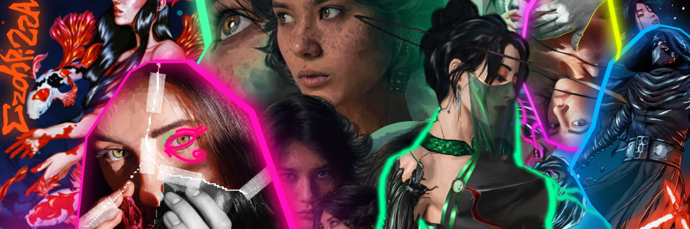

hey there! i/m prateek, a curious computer science undergrad passionate about building smart, scalable, and human-friendly tech.

i/m currently exploring advanced software development with react, fastapi & ai/ml architectures, engrossed in ai/ml research with transformer systems, computer vision and various other deep learning model development and deployment pipelines on the side.

 **python** is my language of choice (because i love backend developement, god bless [tiangolo](https://github.com/tiangolo) for fastapi) while i/m also great at java, javascript, c/c++, sql and r too! i take a keen interest in working with ann architectures, attention mechanisms, and fuzzy logic. i/ve recently got into learning about real-time data pipelines with big data tools (spark, kafka, and the like, the apache stack basically :))

side quests:
- making ml models leaner, faster, and more interpretable because ai doesn/t have to be the blackaox it/s perceived as right now
- designing intuitive frontends that *don’t* look like side projects
- deploying production-ready systems in proper ci/cd pipelines with docker and k8 orchestration

i/ve published 2 scopus-indexed research papers in ai for agriculture and built a novel impurity metric, fuzzy extropy (yes, they shouldn/t exist but they do, i helped build one :)) for the scikit-learn library.

beyond coding, i/m also a graphic designer and artist—i create and share my work on behance!

- get to know more about me at my
[portfolio](https://prateek-mohapatra.vercel.app) 

- or check out my
[art gallery](https://prateeks-art-gallery.webflow.io)

may the source code be with you.

##  socials:
    

##  tech stack:

### languages

        
 

### frontend:
 

### backend: 
            

#### devops and hosting
     

### mL/dL
          

### design

     

hehe

  

#  stats:
 
) 

---
yes, the all of the art included in the banner above is mine, you absolutely may not steal it :)
